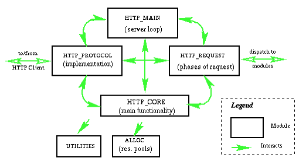

# Mapache Planification & Arquitecture

The core design would be looking something like this

The modules are separated from the core in order to not to change its source code
and to follow module's programming pattern.

## Pre-fork worker model

**How does a "pre-fork worker model" work?**

- *Master Process*: There is a master process that spawns and kills workers, depending on the load and the capacity of the hardware.
More incoming requests would cause the master to spawn more workers, up to a point where the "hardware limit" (e.g. all CPUs saturated) is reached,
at which point queing will set in.

- *Workers*: A worker can be understood as an instance of your application/server. So if there are 4 workers, your server is booted 4 times.
It means it occupies 4 times the "Base-RAM" than only one worker would, unless you do shared memory wizardry.

- *Initialization*: Your initialization logic needs to be stable enough to account for multiple servers. For example, if you write db entries, check if they are
there already or add a setup job before your app server.

- *Pre-fork*: The "pre" in prefork means that the master always adds a bit more capacity than currently required, such that if the load goes up the system is "already ready". So it preemptively spawns some workers. For example in this apache library, you control this with the MinSpareServers property.

- *Requests*: The requests (TCP connection handles) are being passed from the master process to the children.

**What problem do pre-fork servers solve?**

- Multiprocessing: If you have a program that can only target one CPU core, you potentially waste some of your hardware's capacity by only spawning one server. The forked workers tackle this problem.

- Stability: When one worker crashes, the master process isn't affected. It can just spawn a new worker.

- Thread safety: Since it's really like your server is booted multiple times, in separate processes, you don't need to worry about threadsafety (since there are no threads). This means it's an appropriate model when you have non-threadsafe code or use non-threadsafe libs.

- Speed: Since the child processes aren't forked (spawned) right when needed, but pre-emptively, the server can always respond fast.

[🔗 Source](https://stackoverflow.com/questions/25834333/what-exactly-is-a-pre-fork-web-server-model)
